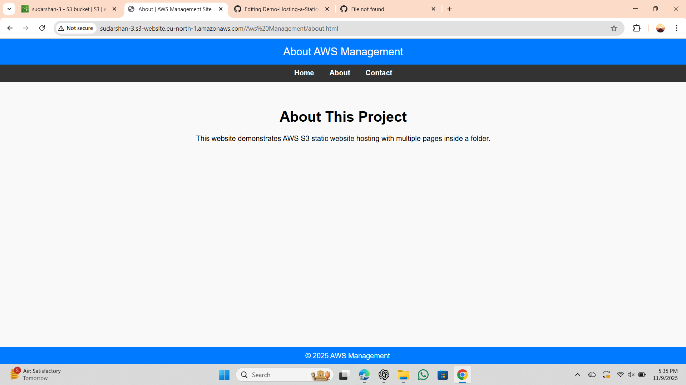
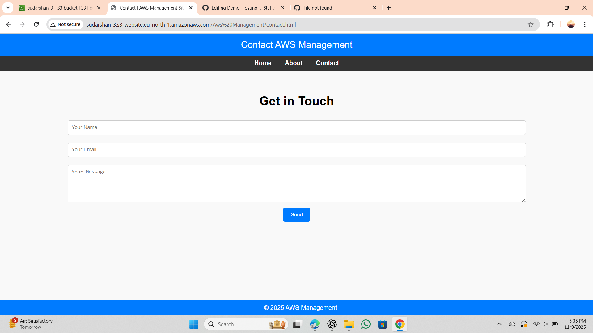

# 🌩️ Hosting a Static Website on Amazon S3

## 📝 1. Introduction
Amazon S3 (Simple Storage Service) can host static websites consisting of HTML, CSS, JavaScript, and image files.  
This guide explains how to deploy and access a **multi-page static website** using **Amazon S3**.

---

## 🧰 2. Prerequisites
- AWS Account  
- Website files (e.g., `index.html`, `about.html`, `contact.html`)  
- Optional CSS and image files  
- Basic knowledge of AWS S3 console  

---

## 📁 3. Create and Configure an S3 Bucket
1. Go to **AWS Console → S3 → Create bucket**
2. Enter a unique **Bucket Name** (e.g., `my-static-site-bucket`)
3. Choose a **Region** (e.g., `us-east-1`)
4. **Uncheck** ✅ “Block all public access”
5. Click **Create bucket**

---

## ⚙️ 4. Enable Static Website Hosting
1. Open your bucket → **Properties tab**
2. Scroll to **Static website hosting**
3. Choose **Enable**
4. Select **Host a static website**
5. Enter:
   - **Index document:** `index.html`
   - **Error document:** `error.html` *(optional)*
6. Click **Save changes**

---

## 📤 5. Upload Your Website Files
Upload your project folder, for example:

---

AWS-Management/
index.html
about.html
contact.html

---
1. Go to the **Objects** tab → click **Upload**
2. Select all files → **Upload**

---

## 🌐 6. Make Files Public
1. Select all uploaded files  
2. Click **Actions → Make public using ACL**  
3. Confirm ✅

---

## 🔗 7. Access Your Website
After enabling static website hosting, copy your **Website endpoint** from:

**S3 → Properties → Static website hosting → Bucket website endpoint**

Example URL: http://sudarshan-3.s3-website.eu-north-1.amazonaws.com/Aws%20Management/index.html

You can now access each page as:

| Page | URL |
|------|-----|
| 🏠 Home | `http://.../AWS-Management/index.html` |
| ℹ️ About | `http://.../AWS-Management/about.html` |
| 📞 Contact | `http://.../AWS-Management/contact.html` |

---

## 🖼️ 8. Output Screenshots (Add Yours Here)

> 📌 Add screenshots of your hosted pages below — just replace the image file names once you upload them into your repo’s `/images` folder.

### 🏠 Home Page
.png)

### ℹ️ About Page

### 📞 Contact Page

---

## ✅ 9. Conclusion
You have successfully hosted a **static website** on **Amazon S3**!  
You can now share your **S3 website URL** publicly.  

---

🧠 *Author:* **Sudarshan Mane**  
🚀 *Project:* Static Website Hosting on AWS S3  
📅 *Last Updated:* November 2025

